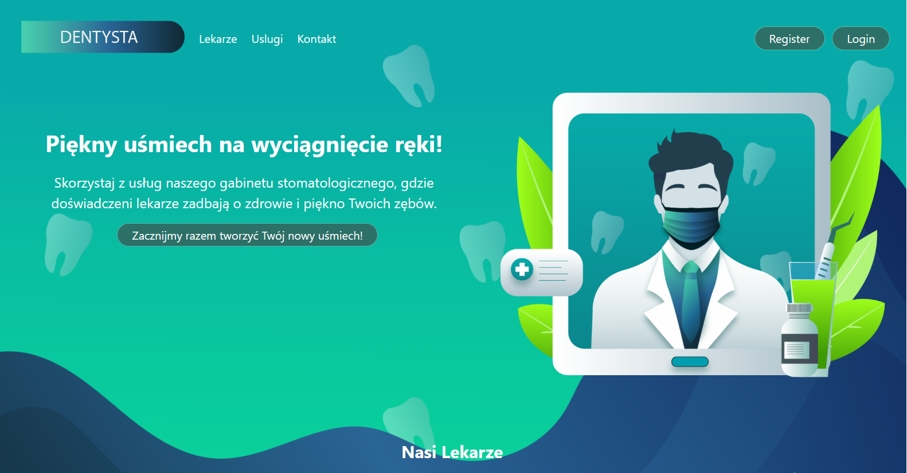

## Dental Clinic Web Application

**Description:**

This web application streamlines patient management for dental clinics. Patients can conveniently create profiles, schedule appointments with dentists, and access their medical data through the platform.

**Technologies:**

* **Database:** Postgres
* **Backend:** Python (FastAPI)
* **Frontend:** React

**Features:**

* **Patient Profile Creation:**  Patients can register and create their profiles within the application.
* **Appointment Scheduling:**  A user-friendly interface allows patients to schedule appointments with dentists at their convenience.
* **Appointment Management:**  Both patients and clinic staff can view, modify, or cancel appointments as needed.
* **Prescription Creation:**  Dentists can create and manage prescriptions electronically within the application.
* **Patient List:**  The application maintains a comprehensive patient list for easy access to patient information.

**GUI:**

